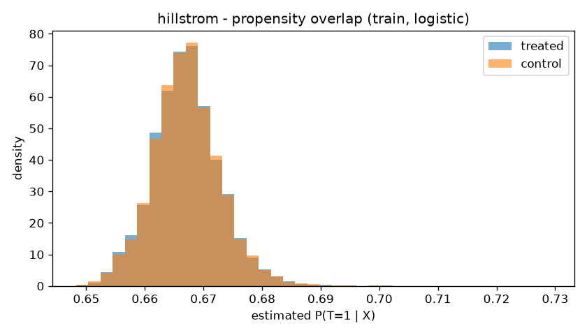
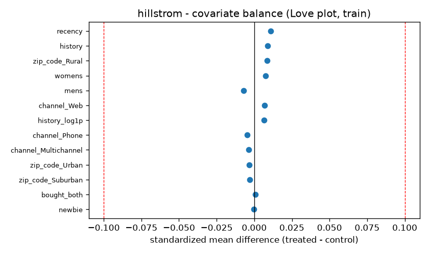

# hillstrom — Treatment/Control & Overlap Diagnostics

## train

- arm counts: `{'womens_email': 17109, 'mens_email': 17046, 'control': 17045}`

| arm | visit | conversion | spend |
|---|---|---|---|
| control | 0.1073 | 0.0057 | 0.6887 |
| mens_email | 0.1831 | 0.0126 | 1.4672 |
| womens_email | 0.1525 | 0.0088 | 1.1195 |

- naive ATE vs control:
  - **mens_email**: visit +0.0758, conversion +0.0068, spend +0.7785
  - **womens_email**: visit +0.0452, conversion +0.0031, spend +0.4308

## test

- arm counts: `{'womens_email': 4278, 'control': 4261, 'mens_email': 4261}`

| arm | visit | conversion | spend |
|---|---|---|---|
| control | 0.1016 | 0.0056 | 0.5092 |
| mens_email | 0.1814 | 0.0124 | 1.2444 |
| womens_email | 0.1470 | 0.0089 | 0.9079 |

- naive ATE vs control:
  - **mens_email**: visit +0.0798, conversion +0.0068, spend +0.7352
  - **womens_email**: visit +0.0454, conversion +0.0033, spend +0.3988

## Covariate balance (train)

- max |SMD| = **0.0110** (flag 0.1); features above flag: **0**

| feature (top 20 by |SMD|) | SMD |
|---|---:|
| recency | +0.0110 |
| history | +0.0088 |
| zip_code_Rural | +0.0086 |
| womens | +0.0076 |
| mens | -0.0072 |
| channel_Web | +0.0069 |
| history_log1p | +0.0065 |
| channel_Phone | -0.0046 |
| channel_Multichannel | -0.0036 |
| zip_code_Urban | -0.0032 |
| zip_code_Suburban | -0.0030 |
| bought_both | +0.0006 |
| newbie | -0.0002 |

## Propensity / positivity

(diagnostic n = 51200)

- **logreg**: AUC 0.4974; support [0.648, 0.729] (p01 0.654, p99 0.683); mass outside trim 0.0000
- **hgb**: AUC 0.5001; support [0.522, 0.773] (p01 0.628, p99 0.711); mass outside trim 0.0000

**Verdict:** Strong overlap consistent with randomization: propensity AUC in the RCT band, support concentrated near P(T=1), no mass in the trim tails. CATE is identified across the covariate space.

