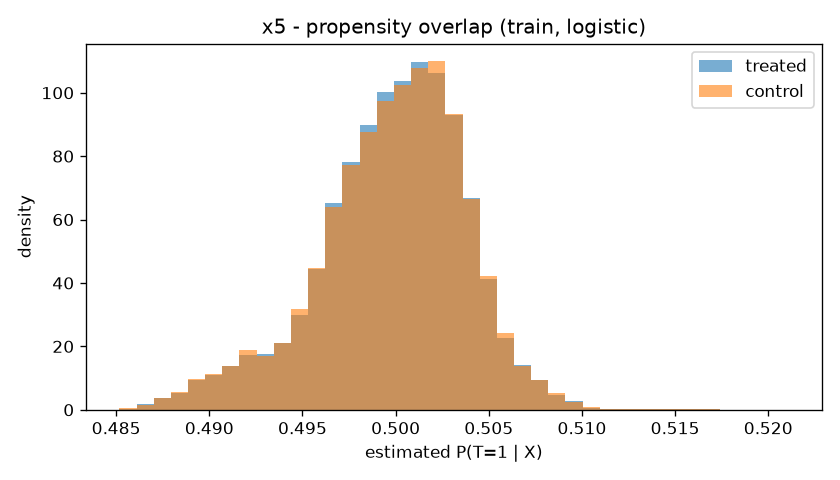
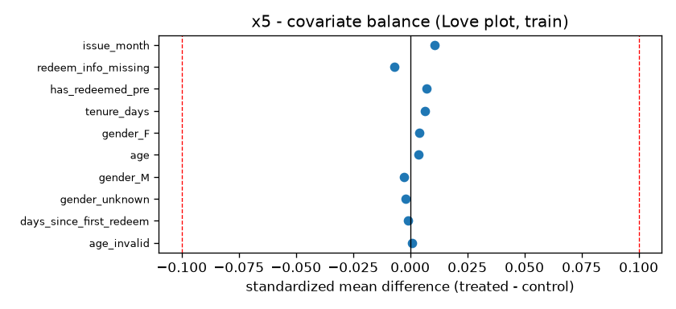

# x5 — Treatment/Control & Overlap Diagnostics

## train

- arm counts: `{'control': 80046, 'treated': 79985}`

| arm | target |
|---|---|
| control | 0.6033 |
| treated | 0.6365 |

- naive ATE vs control:
  - **treated**: target +0.0332

## test

- arm counts: `{'control': 20012, 'treated': 19996}`

| arm | target |
|---|---|
| control | 0.6033 |
| treated | 0.6365 |

- naive ATE vs control:
  - **treated**: target +0.0332

## Covariate balance (train)

- max |SMD| = **0.0107** (flag 0.1); features above flag: **0**

| feature (top 20 by |SMD|) | SMD |
|---|---:|
| issue_month | +0.0107 |
| has_redeemed_pre | +0.0071 |
| redeem_info_missing | -0.0071 |
| tenure_days | +0.0064 |
| gender_F | +0.0040 |
| age | +0.0035 |
| gender_M | -0.0026 |
| gender_unknown | -0.0019 |
| days_since_first_redeem | -0.0011 |
| age_invalid | +0.0010 |

## Propensity / positivity

(diagnostic n = 160031)

- **logreg**: AUC 0.4989; support [0.485, 0.521] (p01 0.489, p99 0.508); mass outside trim 0.0000
- **hgb**: AUC 0.5004; support [0.368, 0.636] (p01 0.468, p99 0.532); mass outside trim 0.0000

**Verdict:** Strong overlap consistent with randomization: propensity AUC in the RCT band, support concentrated near P(T=1), no mass in the trim tails. CATE is identified across the covariate space.

